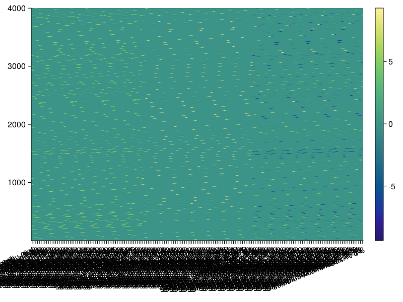

# [Generate a Timeexpanded Designmatrix](@id ht_gen_te_designmatrix)

In the following we discuss how to generate a Timeexpanded Designmatrix.

You start by repeating the first steps (up to and including the Data segment) of the [Designmatrix Visualization tutorial](@ref dm_vis).
Afterwards you continue as follows.

## Plot Timeexpanded Designmatrices

In the code below, data of the `Unfold` module was used.
To display a timeexpanded designmatrix we add the following code:
```
bfDict = Dict(Any=>(f,basisfunction))
ufCont = UnfoldLinearModelContinuousTime(bfDict)
```
The following code will result in the default configuration.
```
cBugDesign = PlotConfig(:designmatrix)
```
At this point you can detail changes you want to make to the visualization through the plot config. These are detailed further below. 

This is how you finally plot the timeexpanded designmatrix.
```
plot_design(designmatrix!(ufCont, evts), cBugDesign)
```


Note that without further adjustments in the configuration, you may experience cluttering of labels. 
As you can see, this is the case here. 

In order to avoid the cluttering problem, we can limit the number of labels with the following configuration.
```
cBugDesign.setExtraValues(xTicks=12, sortData=false)
```
In this case it was set to 12 labels on the x-axis.
We set `sortData=false`, as it makes no sense to sort data for timeexpanded designmatrices (and it is `true` by default).

When plotting the result is as follows:


As you can see labels are cut off to the left.
In the [corresponding How To section](@ref ht_soobl) you can see a workaroundfor it.