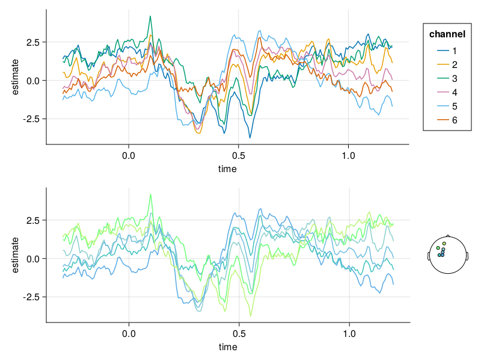

# [Include multiple Visualizations in one Figure](@id ht_mvf)

In this section we discuss how users are able to include multiple visualizations in a single figure.

By using the !-version of the plotting function and putting in a grid position instead of a full figure, we can create Multiple Coordinated Views.

You start by creating a figure with Makie.Figure. 

`f = Figure()`

Now each plot can be added to `f` via the `config.plot!(...)` function by putting in a grid position, such as `f[1,1]`.

```
f = Figure()

cLine = PlotConfig(:line)
cLine.setMappingValues(color=:channel)
cLine.plot!(f[1,1], results_plot_butter)

cButterfly = PlotConfig(:butterfly)
cButterfly.setMappingValues(topoChannels=:channel)
cButterfly.plot!(f[2, 1], results_plot_butter)

f
```



By using the data from the tutorials we can create a big image with every type of plot.

With so many plots at once it's incentivised to set a fixed resolution in your figure to order the plots evenly (Code below).


```
f = Figure(resolution = (2000, 2000))

let
    results_plot_butter = @subset(results_onesubject,
        :coefname .== "(Intercept)",:channel .<7)

    cButterfly = PlotConfig(:butterfly)
    cButterfly.setExtraValues(
        categoricalColor=false,
        categoricalGroup=true,
    )
    cButterfly.setLayoutValues(
        legendPosition=:bottom,
    )
    cButterfly.plot!(f[1, 1], results_plot_butter)
end

let    
    results_plot = @subset(results_onesubject,:channel .==3)
    cLine = PlotConfig(:line)

    cLine.setExtraValues(
        categoricalColor=false,
        categoricalGroup=false,
        stderror=true)
    cLine.setLayoutValues(
        showLegend=true,
        legendPosition=:bottom,
    )
    cLine.setMappingValues(color=:coefname, group=:coefname)
    cLine.setLegendValues(nbanks=2)
    cLine.plot!(f[1,2], results_plot)
end

let    
    results_plot = @subset(results_onesubject,:channel .==3)
    cLine = PlotConfig(:line)
    pvals = DataFrame(
            from=[0.1,0.3],
            to=[0.5,0.7],
            # if coefname not specified, line should be black
            coefname=["(Intercept)","category: face"]
        )
    cLine.setExtraValues(
        categoricalColor=false,
        categoricalGroup=false,
        pvalue=pvals)
    cLine.setLayoutValues(
        showLegend=true,
        legendPosition=:bottom,
    )
    cLine.setVisualValues(linewidth=2)
    cLine.setMappingValues(color=:coefname, group=:coefname)
    cLine.setLegendValues(nbanks=2)
    cLine.plot!(f[1,3], results_plot)
end

let
    using Random
    cErp = PlotConfig(:erp)
    cErp.setExtraValues(meanPlot = true)
    cErp.setVisualValues(;
        colormap=Reverse(:RdBu),
        colorrange = (-30, 30)
    )
    cErp.setLayoutValues(
        showLegend=true,
        legendPosition=:right,
    )

    cErp.plot!(f[2,1], dat_e[28,:,:])
end

let
    cDesignTime = PlotConfig(:design)
    cDesignTime.setExtraValues(xTicks=10, sortData=false)
    cDesignTime.plot!(f[2,2], designmatrix!(ufCont, evts))
end

let
    designmatrix(mres)
    cDesign = PlotConfig(:design)
    cDesign.setExtraValues(xTicks=4, sortData=true)
    cDesign.setLayoutValues(
        showLegend=true,
        legendPosition=:right
    )
    cDesign.setVisualValues(colormap=:inferno)
    cDesign.plot!(f[2,3], designmatrix(mres))
end

let
    topodata, positions = TopoPlots.example_data()
    cTopo = PlotConfig(:topo)
    cTopo.plot!(f[3,1], topodata[1:4, 340, 1];
        labels=["O1", "F2", "F3", "P4"])
end

let
    topodata, positions = TopoPlots.example_data()
    df = DataFrame()
    df.topodata = topodata[1:4, 340, 1]
    df.pos = positions[1:4]
    df.labels = ["O1", "F2", "F3", "P4"]
    
    cTopo = PlotConfig(:eegtopo)
    cTopo.setVisualValues(
        colormap=:viridis
    )
    cTopo.setAxisValues(
        aspect = DataAspect()
    )
    cTopo.plot!(f[3,2], df)
end

let
    results_plot = @subset(results_onesubject,:channel .<=6)
    cParacoord = PlotConfig(:paracoord)
    cParacoord.setLayoutValues(legendPosition=:bottom)
    cParacoord.setLegendValues(nbanks=2)
    cParacoord.setMappingValues(category=:coefname,y=:estimate)
    cParacoord.setExtraValues(
        pc_aspect_ratio = 0.9,
        pc_right_padding = 15,
        pc_left_padding = 34,
        pc_top_padding = 37,
        pc_bottom_padding = 23,
        pc_tick_label_size = 20,
    )
    cParacoord.plot!(f[3,3], results_plot; channels=[5,3,2])    
end

f
```

