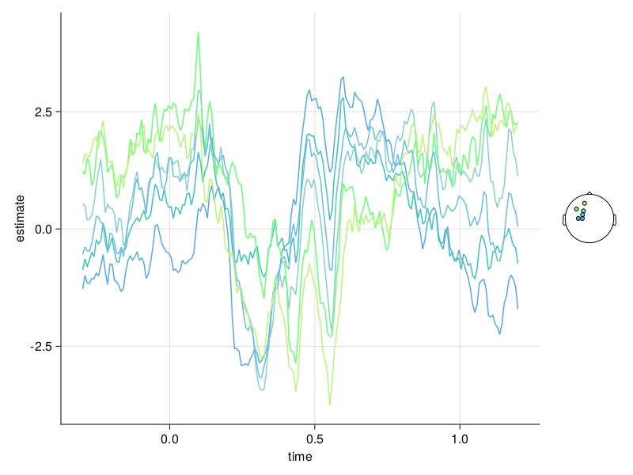

# [Butterfly Plot Visualization](@id bfp_vis)

Here we discuss butterfly plot visualization. 
Make sure you have looked into the [installation instructions](@ref install_instruct).

## Include used Modules
The following modules are necessary for following this tutorial:
```
using Unfold
using UnfoldMakie
using StatsModels # can be removed in Unfold v0.3.5
using DataFrames
using CairoMakie
using DataFramesMeta
```
Note that `DataFramesMeta` is also used here in order to be able to use `@subset` for testing (filtering).

## Data
In case you do not already have data, look at the [Load Data](@ref test_data) section. 

Use the test data of `erpcore-N170.jld2`.

We filter the data to make it more clearly represented:
```
results_plot_butter = @subset(results_onesubject,:coefname .== "(Intercept)",:channel .<7)
```

## Plot Butterfly Plots

The following code will result in the default configuration. 
```
cButter = PlotConfig(:butterfly)
```
At this point you can detail changes you want to make to the visualization through the plot config. These are detailed further below. 

This is how you finally plot the butterfly plot.
```
plot_line(results_plot_butter, cButter)
```




## Configurations for Butterfly Plots

Here we look into possible options for configuring the butterfly plot visualization. 
To build up a butterfly plot, we internally use functions for visualizing line plots.
Hence, the options for configuring the visualization mentioned here are specific for line plots.
For more general options look into the Plot Configuration section of the documentation.

[Here](@ref lp_vis) you can find the configurations for line plots.


## TODO ??
