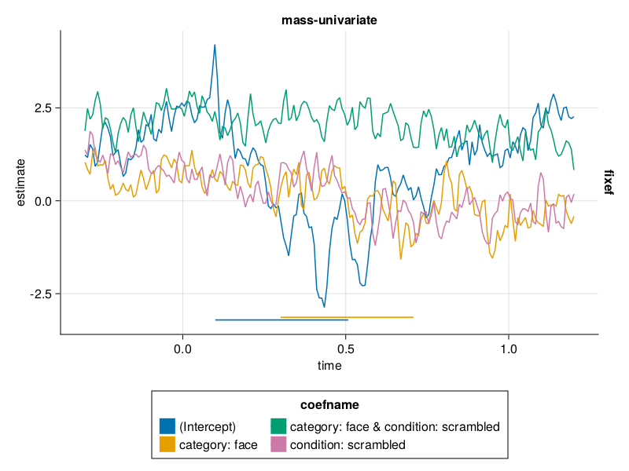

# [Line Plot Visualization](@id lp_vis)

Here we discuss line plot visualization. 
Make sure you have looked into the [installation instructions](@ref install_instruct).

## Include used Modules
The following modules are necessary for following this tutorial:
```
using Unfold
using UnfoldMakie
using StatsModels # can be removed in Unfold v0.3.5
using DataFrames
using CairoMakie
using DataFramesMeta
```
Note that `DataFramesMeta` is also used here in order to be able to use `@subset` for testing (filtering).

## Data
In case you do not already have data, look at the [Load Data](@ref test_data) section. 

Use the test data of `erpcore-N170.jld2`.

We filter the data to make it more clearly represented:
```
results_plot = @subset(results_onesubject,:channel .==3)
```

## Plot Line Plots

The following code will result in the default configuration. 
```
cLine = PlotConfig(:lineplot)
```
At this point you can detail changes you want to make to the visualization through the plot config. These are detailed further below. 

This is how you finally plot the line plot.
```
plot_line(results_plot, cLine)
```


## Configuration for Line Plots

Here we look into possible options for configuring the line plot visualization.
The options for configuring the visualization mentioned here are specific for line plots.
For more general options look into the `Plot Configuration` section of the documentation.
This is the list of unique configuration (extraData):
- categoricalColor (boolean)
- categoricalGroup (boolean)
- pvalue (array)
- stderror (boolean)
- topoLegend (boolean)

Using some general configurations we can pretty up the default visualization. Here we use the following configuration:
```
cLine.setExtraValues(showLegend=true,
    categoricalColor=false,
    categoricalGroup=false)
cLine.setMappingValues(color=:coefname, group=:coefname)
cLine.setLegendValues(nbanks=2)
cLine.setLayoutValues(legendPosition=:bottom)
```


Note that you may need the names when setting mapping values to the data you use.
In the following we will use this "pretty" line plot as a basis for looking into configuration options.


### categoricalColor (boolean)
Indicates whether the column referenced in mappingData.color should be used nonnumerically.
Default is `true`.


### categoricalGroup (boolean)
Indicates whether the column referenced in mappingData.group should be used nonnumerically.
Default is `true`.


### pvalue (array)
Is an array of p-values. If array not empty, plot shows colored lines under the plot representing the p-values. 
Default is `[]` (an empty array).

Shown below is an example in which `pvalue` are given:
```
cLine = PlotConfig(:lineplot)

pvals = DataFrame(
		from=[0.1,0.3],
		to=[0.5,0.7],
		coefname=["(Intercept)","category: face"] # if coefname not specified, line should be black
	)

cLine.setExtraValues(
    categoricalColor=false,
    categoricalGroup=false,
    pvalue=pvals)
cLine.setMappingValues(color=:coefname, group=:coefname)
cLine.setLayoutValues(legendPosition=:bottom)
cLine.setLegendValues(nbanks=2)
plot_line(results_plot, cLine)
```


Note that you may need to the names when setting mapping values to the data you use.


### stderror (boolean)
Indicating whether the plot should show a colored band showing lower and higher estimates based on the stderror. 
Default is `false`.

Shown below is an example where `stderror=true`:
```
cLine.setExtraValues(
    categoricalColor=false,
    categoricalGroup=false,
    stderror=true)
cLine.setMappingValues(color=:coefname, group=:coefname)
cLine.setLegendValues(nbanks=2)
cLine.setLayoutValues(legendPosition=:bottom)
```


Note that you may need to the names when setting mapping values to the data you use.


### topoLegend (boolean)
Indicating whether a topo plot is used as a legend.
Default is `false`.